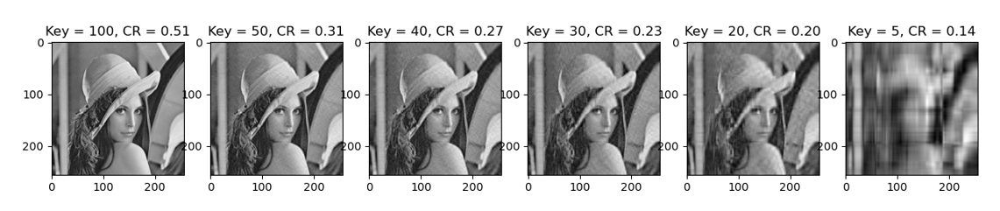

# Image Compression and Analysis

This repository contains Python code for image compression and analysis using Singular Value Decomposition (SVD) and various image processing libraries.

## Description

The code performs the following tasks:

1. Reads an image and converts it to grayscale using five different methods: OpenCV, PIL, Matplotlib, Numpy, and Scikit-Image.
2. Compresses the grayscale image using SVD by varying the number of singular values.
3. Calculates the compression ratio for each compressed image.
4. Calculates the cosine similarity between the original and compressed images to measure the quality of the compression.
5. Calculates the Mean Squared Error (MSE) and Mean Absolute Error (MAE) between the original and compressed images.

## Libraries Used

- numpy
- matplotlib
- PIL
- OpenCV
- scikit-learn
- scikit-image

## Usage

To run the code, open the Jupyter notebook `notebook.ipynb` and execute the cells.

## Results

The results include the compressed images, their compression ratios, and the cosine similarity, MSE, and MAE between the original and compressed images.

Here is a sample output of the grayscale conversion methods:

And here is a sample output of the image compression:

## Contributing

Pull requests are welcome. For major changes, please open an issue first to discuss what you would like to change.

## License

[MIT](https://choosealicense.com/licenses/mit/)
